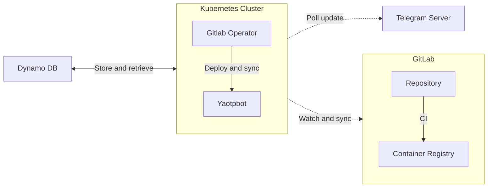

[](https://opensource.org/licenses/MIT) [](https://badge.fury.io/py/yaotpbot)  [](https://github.com/ambv/black)


# Yet Another OTP Bot

[@yaotpbot](https://t.me/yaotpbot) : A Telegram Bot to generate OTPs.

**Disclaimer: This project is intended as a toy project and should not be used for serious or production purposes. The author does not recommend using this for any critical applications.**


## Architecture




### Software
Yaotpbot is written in Python and use [telegram-bot-api](https://github.com/python-telegram-bot/python-telegram-bot) to interact with Telegram.

### Infrastructure
A [DynamoDB](https://aws.amazon.com/dynamodb/) table it's used to store the identifiers of the chats and all the related seeds, needed to generate OTPs. All those information **are stored encrypted** and just decrpyted at runtime, using `dynamodb-encryption-sdk` library with AES encryption.

### Deployment
CI/CD is automated with GitOps. in particular:
- The pipeline
    - Builds the artifact and publishes it on [Pypi](https://pypi.org/project/yaotpbot/);
    - Builds the container using [buildx](https://docs.docker.com.xy2401.com/buildx/working-with-buildx/) to support multiple architecture and push the images on [GitLab container registry](https://gitlab.com/ollaww/yaotpbot/container_registry).
- The [operator](https://docs.gitlab.com/ee/user/clusters/agent/install/index.html) deploys and keep synced the manifests created on a local k3s cluster.

## Installation and usage

The bot can either be used as a container ([registry](https://gitlab.com/ollaww/yaotpbot/container_registry)) or installed directly with `pip` running

```
pip3 install --upgrade yaotpbot 
```
Note that following environment variables must be set:

| Name        | Description |
|---------------------------|---|
| TELEGRAM_API_TOKEN       | Telegram Api Token of your bot needed to interact with Telegram. You always get a new one when [creating a new bot](https://core.telegram.org/bots/api). |
| LOCALSTACK_ENDPOINT       | A localstack endpoint to use when not using AWS. By default the bot looks for a table called `yaotpbot-table` and use `sts` to verify the connection. |
| DYNAMO_AES_SIGN_KEY       | Key used to sign encrypted data stored on DynamoDB. Can be generated running `python scrips/keys.py` |
| DYNAMO_AES_ENCRYPTION_KEY | Key used to encrypt data stored on DynamoDB. Can be generated running `python scrips/keys.py` |
| AWS_ACCESS_KEY_ID         | AWS access key id. Used with `AWS_SECRET_ACCESS_KEY` to interact with DynamoDB. |
| AWS_SECRET_ACCESS_KEY         | AWS secret access key. Used with  `AWS_ACCESS_KEY_ID` to interact with DynamoDB. |
